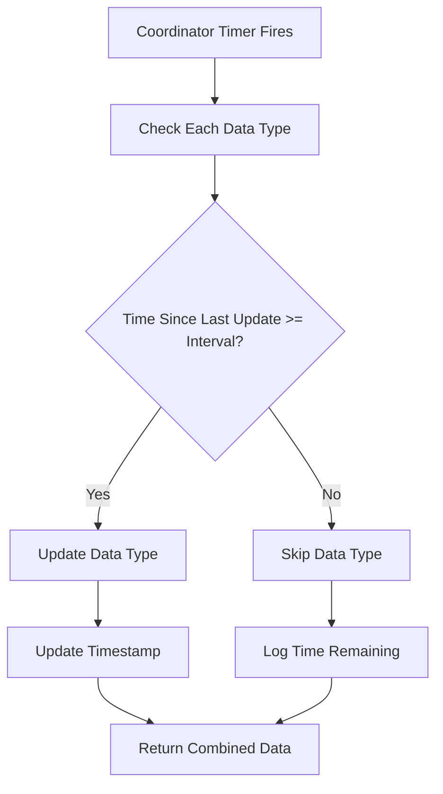

# Update Frequency Fix Documentation

## Issue Summary

After introducing configurable update frequency parameters, the integration stopped updating automatically. Manual reloads worked fine, but automatic updates based on the configured intervals were not functioning.

## Root Cause

The issue was caused by a missing import in [`sensor.py`](../custom_components/aula_easyiq/sensor.py):

1. **Line 5**: Only `timedelta` was imported from the `datetime` module
2. **Line 131**: The `_should_update_data_type()` method tried to use `datetime.now()` 
3. **Line 141**: `datetime` was imported locally inside `_async_update_data()` but not available to `_should_update_data_type()`

This caused a `NameError` when the coordinator tried to check if data types needed updating, preventing all automatic updates.

## Changes Made

### 1. Fixed Import Statement (Line 5)
```python
# Before
from datetime import timedelta

# After
from datetime import datetime, timedelta
```

### 2. Enhanced Error Handling (Lines 121-145)
Added try-except block in `_should_update_data_type()` to:
- Catch and log any errors during interval checking
- Return `True` on error to ensure updates continue
- Provide detailed debug logging for troubleshooting

### 3. Improved Logging
Added comprehensive logging to track:
- When each data type should/shouldn't update
- Time since last update vs configured interval
- Time remaining until next update
- Actual update timestamps for each data type

### 4. Removed Redundant Import (Line 141)
Removed the local `from datetime import datetime` import since it's now at module level.

## How It Works

### Update Cycle Flow



### Configuration

The coordinator uses the **minimum** of all configured intervals as its base update cycle:

```python
# Example: All intervals set to 300 seconds
update_intervals = {
    "weekplan": 300,   # 5 minutes
    "homework": 300,   # 5 minutes
    "presence": 300,   # 5 minutes
    "messages": 300,   # 5 minutes
}

# Coordinator base interval = min(300, 300, 300, 300) = 300 seconds
```

Each update cycle, the coordinator:
1. Checks each data type's last update time
2. Compares time elapsed vs configured interval
3. Updates only data types that have exceeded their interval
4. Updates timestamps for refreshed data types

## Testing Instructions

### 1. Reload the Integration

After applying the fix:

```bash
# In Home Assistant
1. Go to Settings → Devices & Services
2. Find "EasyIQ" integration
3. Click the three dots menu
4. Select "Reload"
```

### 2. Monitor Logs

Enable debug logging to see the update cycle in action:

```yaml
# configuration.yaml
logger:
  default: info
  logs:
    custom_components.aula_easyiq: debug
```

### 3. Expected Log Output

You should see logs like this:

```
[INFO] EasyIQ coordinator initialized with base interval: 300s, individual intervals: {'weekplan': 300, 'homework': 300, 'presence': 300, 'messages': 300}, days config: {'weekplan': 5, 'homework': 5}

[DEBUG] No last update time for weekplan, updating
[DEBUG] No last update time for homework, updating
[DEBUG] No last update time for presence, updating
[DEBUG] No last update time for messages, updating

[INFO] Coordinator update cycle - weekplan: True, homework: True, presence: True, messages: True

[DEBUG] Updated weekplan timestamp to 2025-12-09 20:30:00
[DEBUG] Updated homework timestamp to 2025-12-09 20:30:00
[DEBUG] Updated presence timestamp to 2025-12-09 20:30:00
[DEBUG] Updated messages timestamp to 2025-12-09 20:30:00

# After 5 minutes (300 seconds)
[DEBUG] Should update weekplan: 300.1s >= 300s
[DEBUG] Should update homework: 300.1s >= 300s
[DEBUG] Should update presence: 300.1s >= 300s
[DEBUG] Should update messages: 300.1s >= 300s

[INFO] Coordinator update cycle - weekplan: True, homework: True, presence: True, messages: True
```

### 4. Verify Automatic Updates

1. Note the current state of a sensor (e.g., unread message count)
2. Wait for the configured interval (e.g., 5 minutes)
3. Check if the sensor updates automatically without manual reload
4. Verify in logs that the update cycle ran

### 5. Test Different Intervals

Try configuring different intervals to verify selective updates:

```yaml
# Example: Different intervals for each data type
weekplan_interval: 900   # 15 minutes
homework_interval: 900   # 15 minutes
presence_interval: 300   # 5 minutes
messages_interval: 300   # 5 minutes
```

Expected behavior:
- Coordinator runs every 300s (minimum interval)
- Presence and messages update every 300s
- Weekplan and homework update every 900s

## Configuration Recommendations

### Optimal Intervals

Based on data update frequency and API load:

| Data Type | Recommended Interval | Reason |
|-----------|---------------------|---------|
| **Presence** | 300s (5 min) | Changes frequently during school hours |
| **Messages** | 300s (5 min) | Important for timely notifications |
| **Weekplan** | 900s (15 min) | Changes less frequently |
| **Homework** | 900s (15 min) | Changes less frequently |

### Conservative Settings

For minimal API load:

```yaml
weekplan_interval: 1800   # 30 minutes
homework_interval: 1800   # 30 minutes
presence_interval: 600    # 10 minutes
messages_interval: 600    # 10 minutes
```

### Aggressive Settings

For maximum freshness (higher API load):

```yaml
weekplan_interval: 300    # 5 minutes
homework_interval: 300    # 5 minutes
presence_interval: 180    # 3 minutes
messages_interval: 180    # 3 minutes
```

## Troubleshooting

### Updates Still Not Working

1. **Check logs for errors**:
   ```
   grep "Error checking if" home-assistant.log
   ```

2. **Verify configuration was saved**:
   - Go to integration options
   - Confirm intervals are set correctly
   - Reload integration after changes

3. **Check coordinator initialization**:
   ```
   grep "EasyIQ coordinator initialized" home-assistant.log
   ```

### Partial Updates Only

If only some data types update:

1. Check individual interval settings
2. Look for errors specific to that data type
3. Verify API connectivity for that endpoint

### Performance Issues

If experiencing slowness:

1. Increase all intervals to reduce API calls
2. Monitor Home Assistant CPU/memory usage
3. Check network latency to EasyIQ API

## Related Files

- [`sensor.py`](../custom_components/aula_easyiq/sensor.py) - Main coordinator and sensor implementation
- [`config_flow.py`](../custom_components/aula_easyiq/config_flow.py) - Configuration UI
- [`const.py`](../custom_components/aula_easyiq/const.py) - Default interval constants
- [`client.py`](../custom_components/aula_easyiq/client.py) - API client with selective update support

## Version History

- **v1.0.0**: Initial implementation of configurable intervals
- **v1.0.1**: Fixed datetime import issue preventing automatic updates